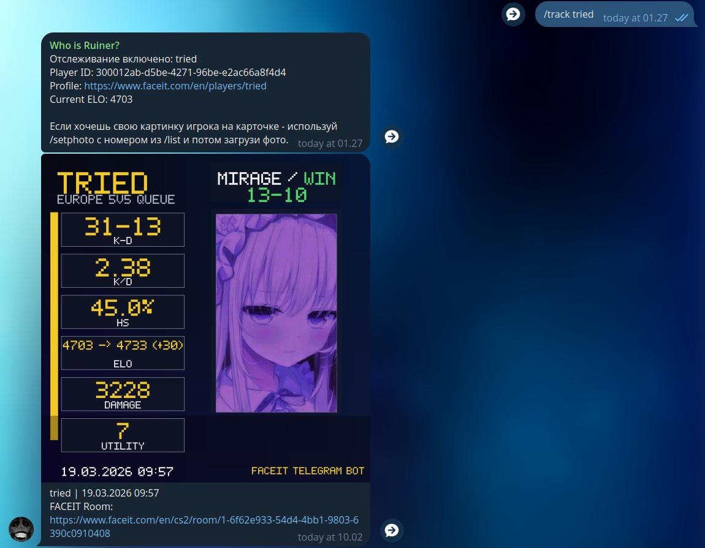
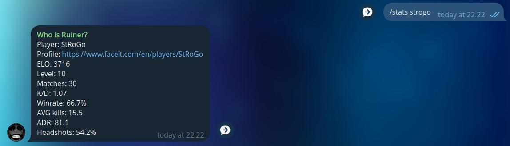
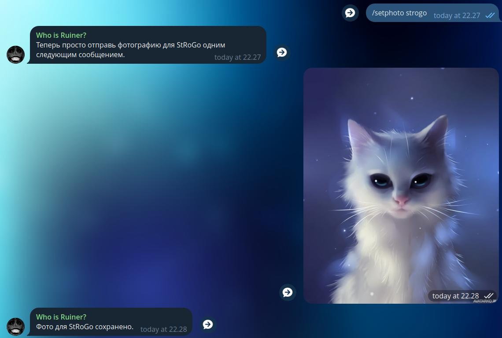
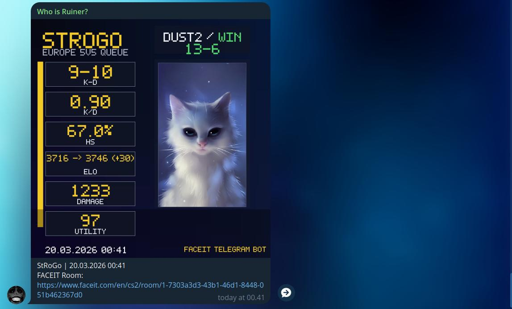

# FACEIT Telegram Bot

Телеграм-бот для отслеживания FACEIT-игроков в CS2. Бот умеет следить за последними матчами, присылать изображение после новой игры, показывать краткую статистику, последний матч и работать и в личных сообщениях, и в группах.

Проект написан на Go и работает через long polling.

## Что умеет бот

- отслеживать игроков FACEIT по нику или ссылке на профиль;
- хранить отдельный список игроков для каждого чата;
- работать и в личных сообщениях, и в группах;
- присылать изображение после нового матча с ELO, K/D, HS%, уроном и счетом карты;
- показывать последний матч игрока;
- показывать краткую статистику игрока;
- привязывать свою фотографию к игроку для карточек;
- удалять и заменять фото игрока;
- защищаться от простого спама:
  - лимит игроков на чат,
  - глобальный лимит игроков,
  - cooldown на команды,
  - ограничение на размер фото.
  
 
 
 

 
 
 

## Команды

- `/start` — краткое описание
- `/help` — список команд
- `/track <FACEIT link или nickname>` — начать отслеживание игрока
- `/list` — показать игроков, которых бот отслеживает в текущем чате
- `/recent <номер из /list | FACEIT link | nickname>` — показать последний матч
- `/stats <номер из /list | FACEIT link | nickname>` — показать статистику игрока
- `/setphoto <номер из /list | FACEIT link | player_id | nickname>` — привязать фото к игроку
- `/removephoto <номер из /list | FACEIT link | player_id | nickname>` — удалить фото игрока
- `/untrack <номер из /list | FACEIT link | player_id | nickname>` — убрать игрока из отслеживания

## Что нужно для запуска

- Go 1.21+
- Telegram bot token
- FACEIT Data API key

## Переменные окружения

Основные настройки лежат в `.env`. Пример уже есть в файле `.env.example`.

Обязательные:

- `FACEIT_API_KEY` — ключ FACEIT API
- `TELEGRAM_TOKEN` — токен Telegram-бота

Основные опции:

- `DATA_DIR` — где хранить данные бота, по умолчанию `data`
- `CHECK_INTERVAL` — как часто проверять новые матчи, например `10m`
- `BOT_TIMEZONE` — часовой пояс для времени в сообщениях, например `Europe/Moscow`
- `FACEIT_DOWNLOADS_TOKEN` — опционально, если потом будет работа с demo download API
- `FACEIT_DOWNLOADS_BASE_URL` — базовый URL для download API

Антиспам и лимиты:

- `MAX_TRACKED_PER_CHAT` — максимум игроков на один чат
- `MAX_TRACKED_GLOBAL` — максимум игроков на весь бот
- `COMMAND_COOLDOWN` — обычный cooldown для команд
- `HEAVY_COMMAND_COOLDOWN` — cooldown для тяжелых команд
- `MAX_PHOTO_BYTES` — максимальный размер фото в байтах

## Запуск локально

### 1. Клонирование проекта

```bash
git clone https://github.com/panttony/faceit-telegram-bot
cd faceit-telegram-bot
```

### 2. Подготовка `.env`

```bash
cp .env.example .env
```

В `.env` свои значения.

### 3. Установка зависимостей и запуск

```bash
go mod download
go run .
```

## Запуск на своем сервере без Docker

Ниже самый простой и понятный вариант: Ubuntu/VPS + systemd.

### 1. Клонирование проекта на сервер

```bash
git clone https://github.com/panttony/faceit-telegram-bot
cd faceit-telegram-bot
```

### 2. Подготовка `.env`

```bash
cp .env.example .env
nano .env
```

### 3. Сборка бинарника

```bash
go build -o faceit-telegram-bot .
```

### 4. Создание systemd unit

```bash
sudo nano /etc/systemd/system/faceit-telegram-bot.service
```

Содержимое:
```ini
[Unit]
Description=FACEIT Telegram Bot
After=network.target

[Service]
Type=simple
WorkingDirectory=/path/to/faceit-telegram-bot
ExecStart=/path/to/faceit-telegram-bot/faceit-telegram-bot
Restart=always
RestartSec=5
User=root

[Install]
WantedBy=multi-user.target
```

### 5. Запуск сервиса

```bash
sudo systemctl daemon-reload
sudo systemctl enable faceit-telegram-bot
sudo systemctl start faceit-telegram-bot
sudo systemctl status faceit-telegram-bot
```

### 6. Просмотр логов

```bash
sudo journalctl -u faceit-telegram-bot -f
```

## Запуск через Docker

Docker в проекте удобен, если надо быстро поднять бота без ручной настройки Go на сервере.

Что уже есть в проекте:

- `Dockerfile`
- `docker-compose.yml`

### Запуск

```bash
cp .env.example .env
# в .env свои значения

docker compose up -d --build
```

### Остановка

```bash
docker compose down
```

### Пересборка контейнера после внесения изменений

```bash
docker compose up -d --build
```

## Настройки в BotFather

Чтобы бот нормально работал и в личных чатах, и в группах:

1. Открыть BotFather.
2. Выберать своего бота через `/mybots`.
3. Зайти в **Bot Settings** → **Allow Groups** → включить группы.
4. Зайти в **Bot Settings** → **Group Privacy** → выключить privacy mode.


## Структура проекта

```text
.
├── bot/  	      # обработчики команд
├── config/       # загрузка конфига и .env
├── faceit/       # работа с FACEIT API
├── monitor/      # периодическая проверка новых матчей
├── renderer/     # отрисовка карточек
├── storage/      # хранение tracked-игроков и фото
├── telegram/     # обертка над Telegram API
├── tools/        # вспомогательные debug-утилиты
├── Dockerfile
├── docker-compose.yml
└── .env.example
```
